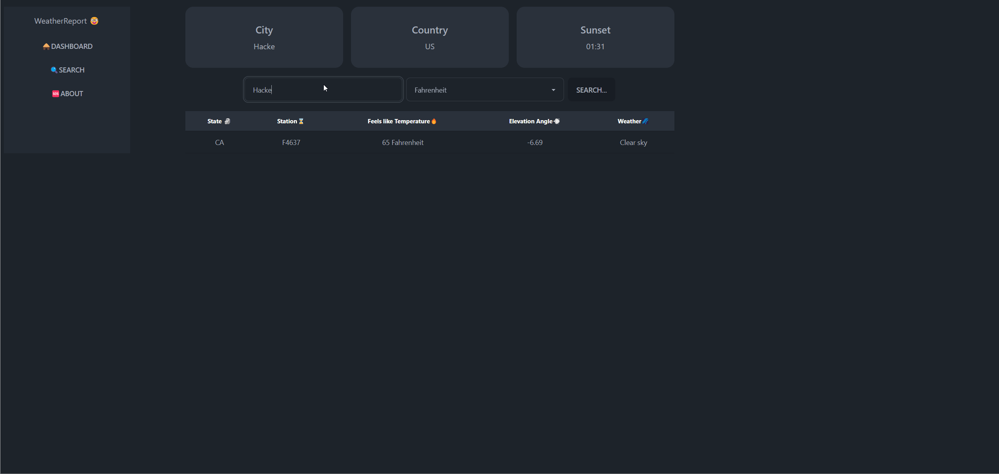

# Web Development Project 5 - WeatherReporter App

Submitted by: Joey Whitehead

This web app: WeatherReporter App utilizes the https://www.weatherbit.io/ API to fetch weather reports throughout the global and display them in a beautiful table. Just enter the city you want and the app will fetch the weather report for you. You can filter the data by city, unit temperature!

Time spent: 8 hours spent in total

## Required Features

The following **required** functionality is completed:

- [x] **The list displays a list of data fetched using an API call**
- [x] **Data uses the useEffect React hook and async/await syntax**
- [x] **The app dashboard includes at least three summary statistics about the data such as**
- [x] _City, Country, Sunset Time, Station, Temperature, Elevation Angle and Weather_
- [x] **A search bar allows the user to search for an item in the fetched data**
- [x] **Multiple different filters (2+) allow the user to filter items in the database by specified categories**

The following **optional** features are implemented:

- [x] Multiple filters can be applied simultaneously
- [x] Filters use different input types such as a text input, a selection, or a slider
- [x] The user can enter specific bounds for filter values

The following **additional** features are implemented:

- [x] Added a beautiful table to display the data
- [x] Added a loading spinner to display while the data is being fetched

## Video Walkthrough

Here's a walkthrough of implemented user stories:

GIF created with LICEcap

## Notes

I had trouble with the API call and getting the data to display in the table but I figured out how to do it, by saving it in state.

## License

    Copyright 2023 Joey Whitehead

    Licensed under the Apache License, Version 2.0 (the "License");
    you may not use this file except in compliance with the License.
    You may obtain a copy of the License at

        http://www.apache.org/licenses/LICENSE-2.0

    Unless required by applicable law or agreed to in writing, software
    distributed under the License is distributed on an "AS IS" BASIS,
    WITHOUT WARRANTIES OR CONDITIONS OF ANY KIND, either express or implied.
    See the License for the specific language governing permissions and
    limitations under the License.
